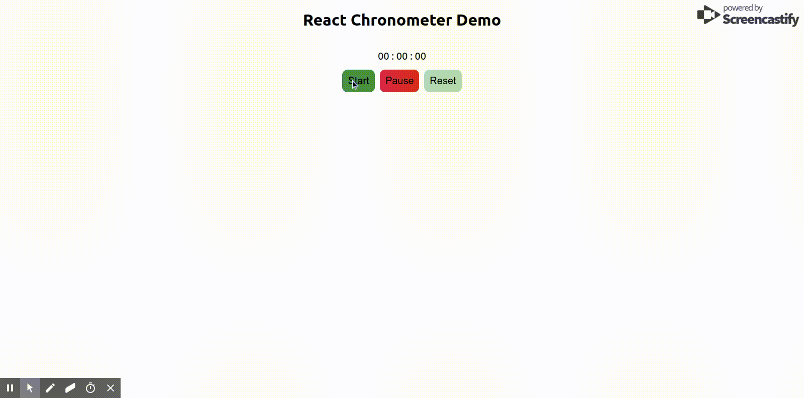

### REACT STOPWATCH

React.js implementation of stop watch.

[](https://badge.fury.io/js/rc-stopwatch)  

<br>

#### Props

Prop              | Type     | Optional | Default     | Description
----------------- | -------- | -------- | ----------- | -----------
timeTextStyle     | Object   | Yes      | {}      | Time style object to style stop watch time.
buttonStyle       | Object   | Yes      |  {}     | Button Style object to apply common style to all buttons
startButtonStyle  | Object   | Yes      | {}      | Start Button Style react object
pauseButtonStyle  | Object   | Yes      | {}      | Pause Button Style react object
resetButtonStyle  | Object   | Yes      | {}      | Reset Button Style react object
containerStyle    | Object   | Yes      | {}      | Container Style react object
buttonContainerStyle    | Object   | Yes      | {}      | Button Container Style react object 
buttonClass       | String   | Yes      | ""      | Common CSS class name
startButtonClass  | String   | Yes      | ""      | Start Button CSS class name
pauseButtonClass  | String   | Yes      | ""      | Pause Button CSS class name
resetButtonClass  | String   | Yes      | ""      | Reset Button CSS class name
containerClass    | String   | Yes      | ""      | Chronometer Container CSS class name
buttonContainerClass   | String   | Yes      | ""      | Button Container CSS class name
timeTextClass     | String   | Yes      | ""      | Time Text CSS class
startButtonText   | String   | Yes      | ""      | Start button text
pauseButtonText   | String   | Yes      | ""      | Pause Button text
resetButtonText   | String   | Yes      | ""      | Reset Button text
onTimeChange      | function | Yes      | () => {}      | Callback function to get time object { seconds, minutes, hours }

#### Usage

```javascript
import React from "react";
import "./App.css";

import Stopwatch from 'rc-stopwatch';

const styles = {
  container: {
    width: "300px"
  },
  startBtn: {
    backgroundColor: "#daaeee",
    color: "#333"
  },
  btn: {
    fontFamily: "monospace"
  },
  title: {
    textAlign: "center",
    color: "#add"
  },
  timeText: {
    fontSize: "19pt",
    fontWeight: "bold"
  },
  btnWrapper: {
    flexDirection: "column"
  },
};

const App = () => (
  <div>
    <h1 style={styles.title}>React Stopwatch Demo</h1>
    <Stopwatch
      buttonClass="button"
      timeTextStyle={styles.timeText}
      buttonContainerStyle={styles.btnWrapper}
      onTimeChange={obj => console.log(obj)}
    />
  </div>
);

export default App;
```

#### Things yet to be done

- [ ] Implement timer