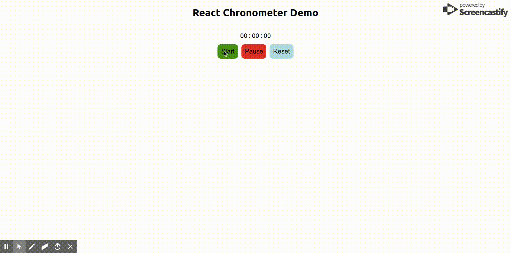

### REACT STOPWATCH

React.js implementation of stop watch.

 

#### Props

Prop              | Type     | Optional | Default     | Description
----------------- | -------- | -------- | ----------- | -----------
timeTextStyle     | Object   | Yes      | {}      | Time style object to style stop watch time.
buttonStyle       | Object   | Yes      |  {}     | Button Style object to apply common style to all buttons
startButtonStyle  | Object   | Yes      | {}      | Start Button Style react object
pauseButtonStyle  | Object   | Yes      | {}      | Pause Button Style react object
resetButtonStyle  | Object   | Yes      | {}      | Reset Button Style react object
containerStyle    | Object   | Yes      | {}      | Container Style react object for 
buttonClass       | String   | Yes      | ""      | Common CSS class name
startButtonClass  | String   | Yes      | ""      | Start Button CSS class name
pauseButtonClass  | String   | Yes      | ""      | Pause Button CSS class name
resetButtonClass  | String   | Yes      | ""      | Reset Button CSS class name
containerClass    | String   | Yes      | ""      | Chronometer Container CSS class name
buttonContainerClass   | String   | Yes      | ""      | Button Container CSS class name
timeTextClass     | String   | Yes      | ""      | Time Text CSS class